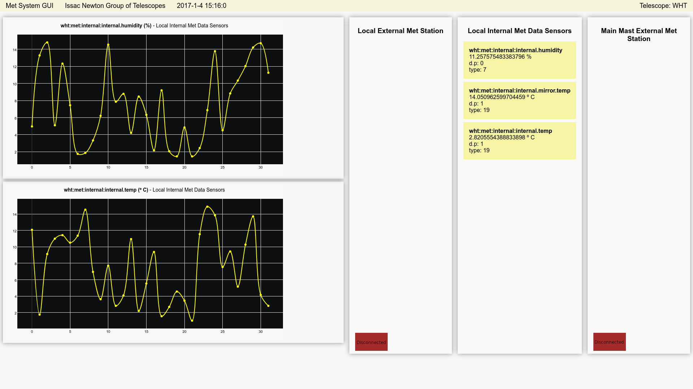
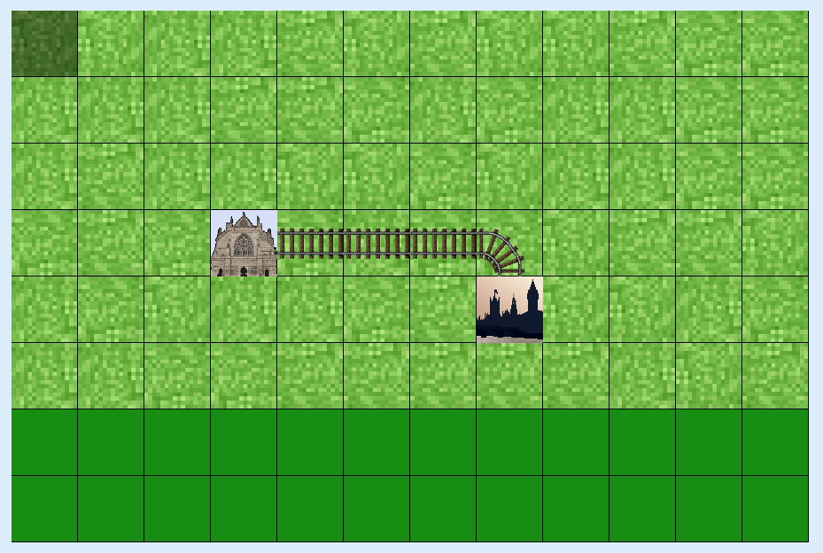

### Hi there 👋

I'm a Data Engineer focused on data warehousing, cataloguing, streaming, and processing software.

I am currently:
- Developing software for the ISIS Neutron and Muon Source data pipeline that spans from the ingestion of scientific data, to [data reduction](https://github.com/autoreduction/queue-processor) and the [cataloguing of data](https://data.isis.stfc.ac.uk/) using ETL jobs for scientists to later analyse.
- Creating the first data platform for open global meteor data. Try out [gmn-python-api](https://github.com/rickybassom/gmn-python-api).
- Building an online AI-powered data catalogue for educational material. [Find out more](https://mars-exeter.github.io).

Email: rickybassom@gmail.com
 
LinkedIn: https://www.linkedin.com/in/ricky-bassom/

 

  
Skills

   
  <b>Programming Languages:</b> Python, Java, C, C++, C#, Go, Vala, JavaScript, Dart, PHP, Haskell, Prolog, Bash
   
  <b>Database Management:</b> Data Normalisation & Warehousing, Data Cataloguing & Governance, ETL, Product Development, Oracle, MySQL, Postgres, SQLite
   
  <b>Systems:</b> AWS (EC2, Lightsail), On-prem Linux (Debian, Red Hat), Windows Server 2019, GitHub Pages static sites
   
  <b>Other:</b> Kafka, ActiveMQ, Redis, Airflow, ELK stack, Jenkins, GitHub Actions, Travis CI, Pandas, Flask, Django, Selenium, HTML/CSS, SQL, Avro, Docker, Git, D3, Matplotlib

  
Other Projects

  <h3>Met System GUI</h3>
  
  
Created data pipelines for real-time meteorological data at the <a href="https://www.ing.iac.es/astronomy/telescopes/wht/">William Herschel Telescope</a>. I also created a new web dashboard for scientists in the control center.

  <ul>
    <li>Python</li>
    <li>Dart</li>
    <li>HTML/CSS/JS</li>
    <li>Redis</li>
  </ul>
  

  
  <h3>Mathematics without Tears and Fears</h3>
  
  
A set of online pedagogical games aimed at teaching mathematical principles and recording game data for the <a href="https://www.exeter.ac.uk/">University of Exeter</a>.

  <ul>
    <li>Python</li>
    <li>Flask</li>
    <li>HTML/CSS/JS</li>
    <li>MySQL</li>
    <li>Redis</li>
    <li>Docker</li>
    <li>AWS</li>
  </ul>
  

  
  <h3>ROV 2 SPS</h3>
  
  
A cross-platform desktop application developed for <a href="https://magseisfairfield.com/">Magseis Fairfield</a>, used for real-time csv manipulation.

  <ul>
    <li>Python</li>
    <li>GTK</li>
    <li>CSV</li>
    <li>Linux and Windows cross-platform packaging</li>
  </ul>
  

